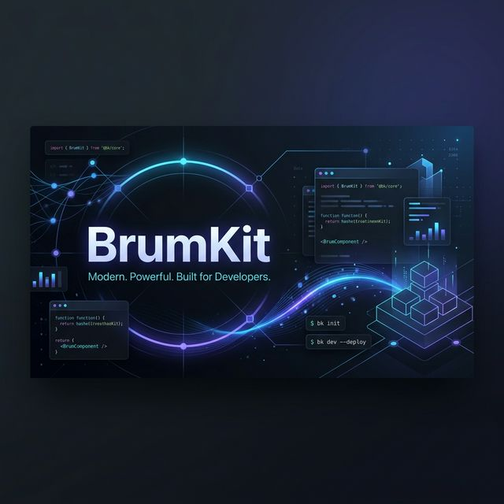

# 🚀 BrumKit - Open Source Edition (Lite)

**Version 0.1.0** | A production-ready Next.js 15 starter kit with authentication, authorization, and essential features.

Start building your SaaS faster with our Next.js 15 + Prisma + Tailwind CSS v4 starter kit.

👉 **Looking for a full-featured SaaS Starter Kit?** [Check out BrumKit Pro](#comparing-oss-vs-pro-version)

⭐️ **Why Developers Trust BrumKit:**

- 🏗️ **Production-grade architecture**: Scalable monorepo with Turborepo.
- 🔐 **Comprehensive Security**: Built-in RBAC and CASL-powered permissions.
- 🧪 **Strict Quality**: 80%+ test coverage requirement with Vitest.
- ⚡ **Modern Stack**: Next.js 15, Prisma 6, Tailwind CSS 4.
- 📦 **Type-Safe**: End-to-end TypeScript implementation.

---

## 🏗️ What's Included

### Core Architecture

- 📦 **Turborepo monorepo**: Optimized build system and pnpm workspaces.
- 🏗️ **Next.js 15 (App Router)**: The latest features of React server components.
- 🎨 **Shadcn UI + Tailwind 4**: Clean, modern, and highly customizable UI system.
- 🗄️ **PostgreSQL + Prisma**: Reliable and type-safe database management.
- 🔐 **Auth.js v5**: Robust authentication for Next.js applications.
- 🌐 **next-intl**: Full i18n support for global applications.

### Key Features

- 👤 **Complete Auth Flow**: Email/password, verification, and password reset.
- 🛡️ **RBAC Authorization**: Fine-grained permissions (USER, MODERATOR, ADMIN, SUPER_ADMIN).
- 👤 **User Profiles**: Profile management, avatar uploads, and account settings.
- 🔔 **Notifications**: Real-time ready notification system with read/unread tracking.
- 🚀 **Rate Limiting**: Redis-based protection for sensitive routes.
- 🐳 **Docker-Ready**: Local containerized development environment.

---

## 🛠️ Technology Stack

BrumKit provides a rock-solid foundation for high-performance applications:

| Category       | Technology                                   | Description                                                            |
| -------------- | -------------------------------------------- | ---------------------------------------------------------------------- |
| **Framework**  | [Next.js 15](https://nextjs.org/)            | Modern React framework with App Router and Server Components.          |
| **Styling**    | [Tailwind CSS 4](https://tailwindcss.com/)   | A utility-first CSS framework for rapid UI development.                |
| **Database**   | [Prisma 6](https://www.prisma.io/)           | Type-safe ORM for Node.js and TypeScript.                              |
| **Auth**       | [Auth.js](https://authjs.dev/)               | Authentication for Next.js applications (formerly NextAuth).           |
| **Monorepo**   | [Turborepo](https://turbo.build/)            | High-performance build system for JavaScript and TypeScript codebases. |
| **Validation** | [Zod](https://zod.dev/)                      | TypeScript-first schema validation with static type inference.         |
| **State**      | [TanStack Query](https://tanstack.com/query) | Powerful asynchronous state management for TS/JS.                      |
| **Testing**    | [Vitest](https://vitest.dev/)                | Blazing fast unit test framework powered by Vite.                      |

---

## 📉 Comparing OSS vs Pro Version

BrumKit OSS is the **"Lite"** foundation, focused on the core authentication, authorization, and architectural essentials.

| Feature                     | OSS (Lite) | Pro Version |
| --------------------------- | ---------- | ----------- |
| **Authentication**          | ✅         | ✅          |
| **Authorization (RBAC)**    | ✅         | ✅          |
| **Global i18n**             | ✅         | ✅          |
| **Database (Prisma)**       | ✅         | ✅          |
| **Team Management**         | ❌         | ✅          |
| **Billing & Subscriptions** | ❌         | ✅          |
| **Advanced Admin Panel**    | ❌         | ✅          |
| **Priority Support**        | ❌         | ✅          |

---

## 🏁 Getting Started

### Prerequisites

- **Node.js**: >= 20.19.0
- **PNPM**: >= 10.0.0
- **Docker**: For running infrastructure (PostgreSQL, Redis)

### Installation

1. **Clone the repository:**

   ```bash
   git clone <repository-url>
   cd brumkit
   ```

2. **Install dependencies:**

   ```bash
   pnpm install
   ```

3. **Set up environment variables:**

   ```bash
   cp .env.development.example .env.development
   # Also copy for the database package:
   cp .env.development.example packages/database/.env
   ```

4. **Start infrastructure (Docker):**

   ```bash
   docker compose --env-file .env.development up -d
   ```

5. **Run migrations & setup:**

   ```bash
   pnpm --filter @repo/database db:migrate
   pnpm --filter @repo/database db:seed
   ```

6. **Start development server:**
   ```bash
   pnpm dev
   ```

The application will be available at [http://localhost:3000](http://localhost:3000).

---

## 📂 Project Structure

```
brumkit/
├── apps/
│   └── web/                 # Next.js 15 application
├── packages/
│   ├── auth/                # Auth.js integration
│   ├── database/            # Prisma schema & client
│   ├── email/               # Templates & sending
│   ├── rate-limit/          # Redis rate limiting
│   ├── ui/                  # Shared Shadcn components
│   ├── validation/          # Zod schemas
│   ├── types/               # Shared TS types
│   └── branding/            # Brand assets
└── docker/                  # Local infrastructure config
```

---

## 🔑 Environment Variables

The root `.env.development` file manages both the web app and the Docker infrastructure.

| Variable              | Description                        | Default                 |
| --------------------- | ---------------------------------- | ----------------------- |
| `NEXT_PUBLIC_APP_URL` | The URL of your application        | `http://localhost:3000` |
| `DATABASE_URL`        | Connection string for Prisma       | `postgresql://...`      |
| `NEXTAUTH_SECRET`     | Secret for session encryption      | `replace-me`            |
| `REDIS_URL`           | Redis connection for rate limiting | `redis://...`           |
| `USE_MAILHOG`         | Enables local mail catching        | `true`                  |

---

## 🧪 Testing Strategy

BrumKit follows Test-Driven Development (TDD) with strict quality standards:

- **Minimum Coverage**: 80%+ across all packages.
- **Framework**: Vitest 4 + React Testing Library.

```bash
pnpm test             # Run all tests
pnpm test:coverage    # Generate coverage report
pnpm test:watch       # Watch mode for development
```

---

## 🚀 Deployment

BrumKit is optimized for deployment on **Vercel**.

[](https://vercel.com/new/clone?repository-url=<repository-url>)

### Instructions:

1. Push your code to GitHub.
2. Link your repository to Vercel.
3. Add your environment variables in the Vercel Dashboard.
4. Set the build command to `pnpm run build`.

---

## 🤝 Contributing & Support

- **Contributing**: Please see [CONTRIBUTING.md](CONTRIBUTING.md) for our TDD flow.
- **Issues**: Report bugs in [GitHub Issues](<repository-url>/issues).
- **Documentation**: Explore the [docs/](docs/) folder for detailed guides.

---

## ⚖️ License

Licensed under the [MIT License](LICENSE).

---

**Built and maintained by [BuildInClicks](https://buildinclicks.com)**
